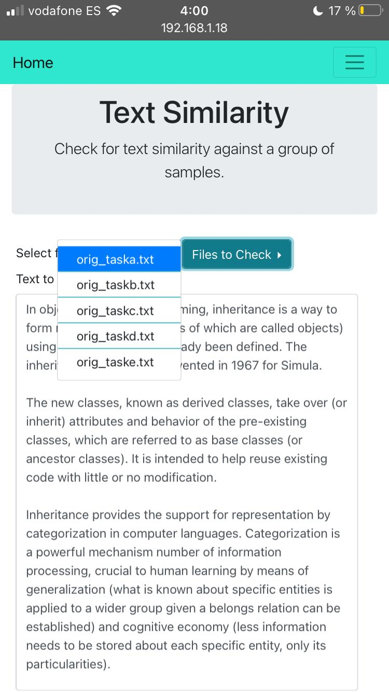

# Demo WebApp with some NLP applications

For now it only has text-comparison for plagiarism detection. Generates a dictionary from a set of sample-texts and compares texts against it to check for similarity.

## - Desktop 

## - Phone

